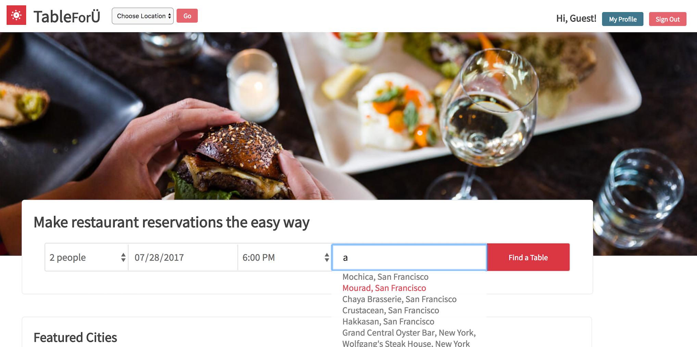
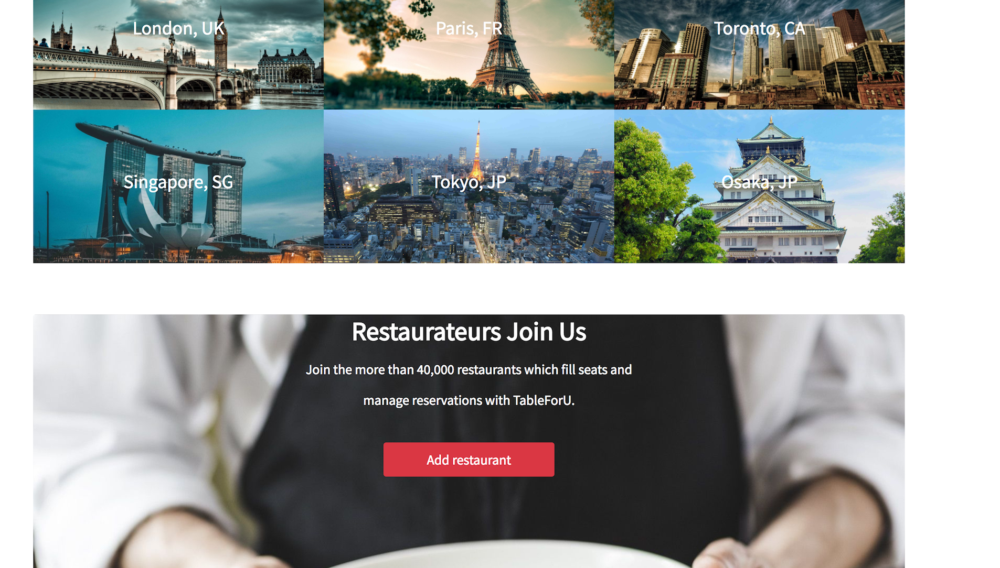
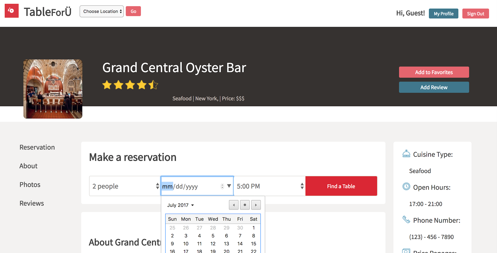

<h1>TableForU<h1>

[heroku]: https://table-for-you.herokuapp.com/

[TableForU][heroku] is a full-stack web application inspired by OpenTable, it allows you to search and reserve restaurants at ease.
This application is built with Ruby on Rails on the backend, a PostgreSQL database, React.js and Redux architectural framework on the frontend.  




<h3>City and Restaurants<h3>
In the database, each restaurant is grouped inside the city with city_id. So when the city is called, the relative restaurants are also accessible from the users. Most of us will benefit from it, when it comes to searching restaurants in the specific area.   



<h3>Create and Search Restaurants<h3>
This application can be scaled by adding more restaurants. By clicking the "join button" at the bottom of the page, you can add your restaurant and take reservations from users. After the submission, your restaurant will be available on the list and also will be searched by users. Currently, with this limited numbers of restaurants, search functions will find matches based on every single character you typed in and display.



<h3>Make Reservations<h3>
Reservation form exists inside each restaurant's page. Once you select the time and submit the form, it will hit the database and will be stored in the joint table between users and restaurants with the specific date and time. This allows us to manage and keep track of records. In your profile page, all reservations are sorted and stored either in Upcoming reservations or Past reservations. All you favorites restaurants are also listed and can be edited in the profile page.


```upcomingReservations() {
    const upcoming = [];
    const past = [];
    const today = new Date().toJSON();
    const allRes = this.props.currentUser.reservations;
    allRes.forEach((res) => {
      if (Date.parse(today.slice(0,10)) >= Date.parse(res.date)) {
        past.push(res);
      } else {
        upcoming.push(res);
      }
    });

    return(
      <div>
        {upcoming.map((res, idx) =>
          <section key={idx} className='upcoming-item'>
            <section className='upcoming-item-left'>
              
            </section>
```


<h3>Rating, Reviews and Favorites<h3>
Once your reservation day passed, the review form will be available for you to share the experience. Those rating and reviews are made only by registered users. When unauthorised users try to access, they will be encouraged to sign up or will be redirected to homepage by protected routes.
